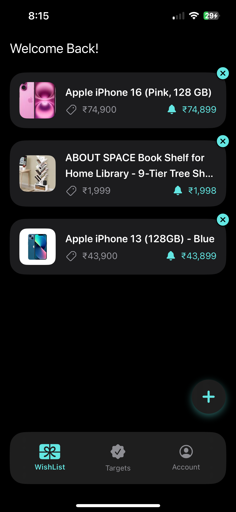
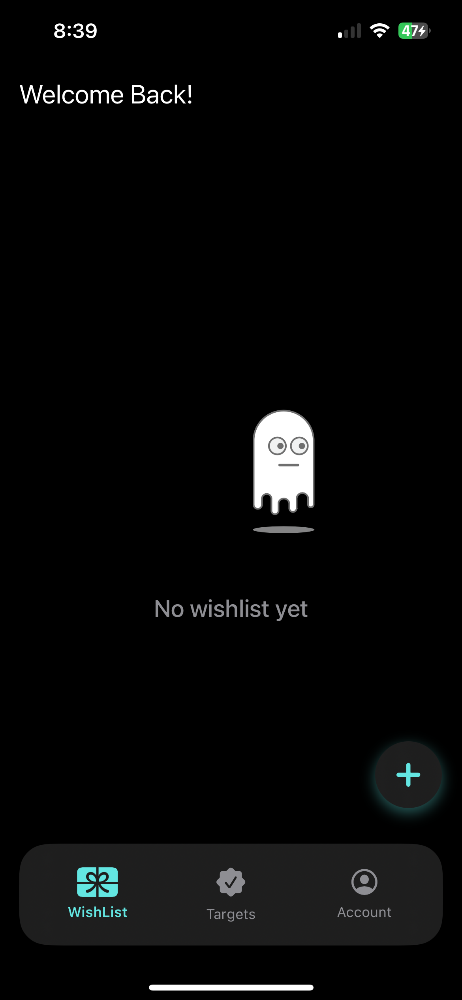

# Smart Wishlist App

**Smart Wishlist** is a SwiftUI app that lets users track product prices from Amazon and Flipkart.  
Users can add products by URL, view current prices, set target price alerts, and get notified when prices drop.

---

## 🖼️ Screenshots

  
  
  
  
  
  
  


---

## 🚀 Features

- Add products by URL from Amazon and Flipkart  
- View current prices and set target price alerts  
- Real-time Firestore sync  
- Price drop notification popups  
- Clean SwiftUI interface with dark mode  
- Backend scrapes prices automatically  

---

## 🛠️ Tech Stack

**Frontend (wishCart)**  
- Swift, SwiftUI, Lottie

**Backend (Wishlist_Backend)**  
- Node.js, Firebase Firestore, Axios, Puppeteer  

---

## 💻 How to Run

### Frontend (`wishCart`)
1. Open `wishCart` folder in Xcode  
2. Build and run  

### Backend (`Wishlist_Backend`)
1. Open terminal:  
```bash
cd Desktop/wishlist-project/Wishlist_Backend
npm install
node index.js
